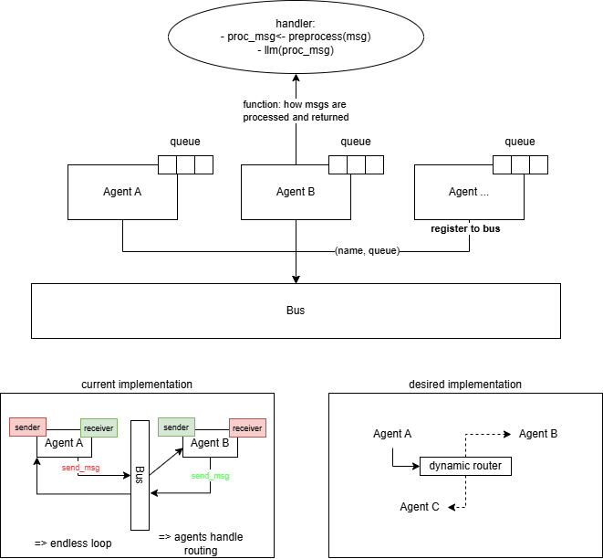

# LLM Agent-to-Agent (A2A) — from scratch

A small, experimental framework for agent-to-agent (A2A) communication implemented in Python. The goal is to create a network of agents that connect and collaborate to solve tasks, following the ideas from the A2A protocol: https://a2a-protocol.org/latest/.

This repository contains a minimal, extensible implementation that supports in-process (threaded) agents and a simple message bus. It's intended as a learning/demo project and a starting point for building multi-agent workflows.

## Highlights

- Simple abstract `BaseBus` interface and a `ThreadBus` implementation for inter-thread messaging.
- `AgentThread` provides a basic threaded agent runner with message handling.
- `models/Message.py` defines the message format used across agents.
- Example runner: `main_threads.py` demonstrates two agents exchanging messages.

## Quick start

Requirements:

- Python 3.8+
- See `requirements.txt` for optional dependencies used by agent logic (LLM integrations are left for you to add).

Install (optional virtualenv):

```bash
python3 -m venv .venv
source .venv/bin/activate
pip install -r requirements.txt
```

Run the threaded example:

```bash
python3 main_threads.py
```

The script starts two agents (`Agent A` and `Agent B`). Type messages at the prompt to send messages from `Agent A` to `Agent B`. Type `exit` to shut down cleanly.

## Project layout

- `agent/` — agent implementations and helpers (e.g., `ThreadAgent.py`).
- `bus/` — bus interface and implementations (`BaseBus.py`, `ThreadBus.py`).
- `models/` — message model (`Message.py`).
- `threading/` — small threading utilities and examples.
- `main.py` — (alternative/demo entrypoint).

## Design notes

- Message shape is defined in `models/Message.py` — keep messages small and serializable.
- `BaseBus` is an abstract interface so you can add other transports (multiprocessing, networked TCP/HTTP/WS, or broker-based like Redis/NATS).
- Agents are decoupled from the transport; they interact with the bus via `register`, `send`, and `broadcast`.

## Next steps and ideas

- Integrate with an LLM backend for agent reasoning.
- Add tests and CI.
- Add a networked bus (WebSocket or gRPC) to connect agents across machines.
- Add message signing/auth and discovery for real A2A compatibility.

## References

- A2A protocol: https://a2a-protocol.org/latest/

---

This is a small educational project — feel free to open issues or send PRs.

License: MIT
# Introduction

I am building a mini framework for A2A communication. Goal is to create a network of agents that connect and solve tasks together.

# System Diagram



# Get Started
1. Create virtual environment `python -m venv .venv`.
2. Activate the virtual environment.
3. Install the dependencies. Example with pip: `pip install -r requirements.txt`
4. Run the entrypoint script: `python main_threads.py`

# Code Quality (desired)
- Linter: [ruff](https://github.com/astral-sh/ruff)
- Testing: [pytest](https://github.com/pytest-dev/pytest)